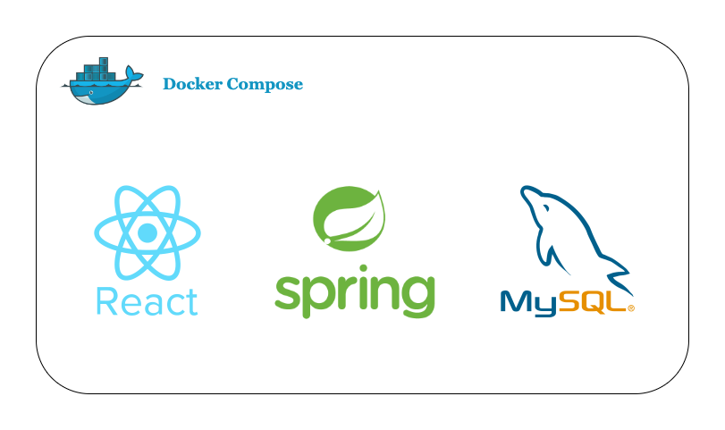

### React Product App using Spring Boot as the backend

## Overview
This repository hosts the `#TWSThreeTierAppChallenge` for the TWS community. 
The challenge involves deploying a Three-Tier Web Application using ReactJS, NodeJS, and Arura RDS MySQL, with deployment on AWS EKS.

# 🛒 Final Capstone: React Product App

A cloud-native, full-stack e-commerce product application built with **React (frontend)**, **Java Spring Boot (backend)**, and **MySQL (Amazon RDS)**. The application is containerized, secured, monitored, and deployed using AWS-native services and DevOps best practices.

---

# Terraform-Capstone 🚀

This is a **Capstone Infrastructure as Code (IaC) project** using **Terraform** to provision and manage AWS cloud infrastructure in a scalable, automated, and reusable manner. It follows DevOps best practices for infrastructure automation and modular design.

---

## 🧱 Project Objective

The goal of this project is to design, implement, and deploy a complete cloud environment on AWS using Terraform. It demonstrates your understanding of key Terraform concepts such as modules, state management, provisioning, and cloud resource orchestration.

---

## 🛠️ Technologies Used

- **Terraform** (v1.x)
- **AWS** (EC2, VPC, S3, IAM, Security Groups, etc.)
- **Git & GitHub** (version control)
- **VS Code / IDE** (for editing)
- **AWS CLI**

---

## 📦 Features

- ✅ Modular Terraform code structure  
- ✅ Provisioning of secure VPC with public/private subnets  
- ✅ EC2 instances with Security Groups  
- ✅ Internet Gateway, Route Tables configuration  
- ✅ Auto scaling and Load Balancer setup (if applicable)  
- ✅ Remote backend support for storing Terraform state in S3  
- ✅ IAM role and policy creation  
## 🚀 Tech Stack

### Frontend
- React.js
- Axios, React Router DOM
- Dockerized

### Backend
- Java Spring Boot
- REST APIs for product management
- Dockerized

### Database
- MySQL on Amazon RDS

---

## ☁️ Cloud Architecture

This project follows a **three-tier architecture** deployed on AWS using **EKS** (Elastic Kubernetes Service):

### Infrastructure
- Provisioned using **CloudFormation** and **Terraform**
- Deployed in **two AWS regions** for failover and high availability
- Uses **Amazon ECR** to store Docker images

### Kubernetes Setup
- Manifests for frontend, backend, and MySQL configured in `k8s/`
- **Ingress Controller** for **path-based routing**
- **Application Load Balancer (ALB)** to distribute traffic

### DevOps & Security
- **CI/CD pipeline** using AWS CodePipeline
- **SonarQube** for code quality
- **CloudWatch** for centralized logging and monitoring
